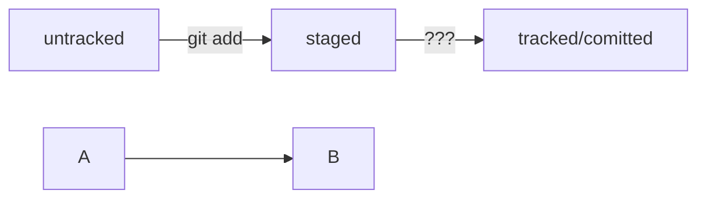

## Команды командной строки

touch - создать файл

mkdir - создать папку (make directory)

mkdir -p dir1/dir-inside/dir-deeper-inside - создать структуру директорий (флаг -p)

Также можно использовать обе команды вместе с символом домашней директории (~) или родительской директории (..). 
Например, команда mkdir ~/my-git-projects создаст папку my-git-projects внутри домашней директории.
А команда touch ../../file.txt создаст файл file.txt на две папки выше по иерархии. 
Допустим, если вы находитесь в директории projects/git/hello, команда touch ../../file.txt создаст файл по такому пути: projects/file.txt.

touch first-project/data.txt first-project/table.csv - можно создать одновременно несколько файлов

cp data.txt ~ - копировать файл data.txt в домашнюю дирректорию

mv table.csv ./very-important-files - переместить файл в папку

cat myfile.txt - выводит содержание текстового файла (concatenate and print — «объединить и распечатать»)

rm example.txt - удалить файл (remove)

rmdir my_dir - удалить директорию (remove directory), если она пуста

rm -r my_dir - удалить директорию со всем ее содержимым (r - recursive - рекурсивный)

mkdir second-project && cd second-project && touch index.html style.css - для выполнения нескольких команд их нужно разделять двумя амперсандами &&

tab - помогает вспомнить/заполнить имя директории

cd /c - в основную директорию (диск С)

cat ~/.gitconfig - прочитать файл с конфигурацией (имя и емэйл) или git config --list

$ cd ~/dev/first-project # перешли в нужную папку

$ **git init** # создать репозиторий

Если вы случайно сделали Git-репозиторием не ту папку, её можно «разгитить». Для этого нужно удалить скрытую подпапку .git.

rm -rf .git # удалили подпапку .git

Разберём подробнее, что такое -rf:

ключ -r (от англ. recursive — «рекурсивно») позволяет удалять папки вместе с их содержимым;

ключ -f (от англ. force — «заставить») избавит вас от вопросов вроде «Вы точно хотите удалить этот файл? А этот? И этот тоже?».

**git status** - показывает текущее состояние репозитория

**git add** --all - подготовить к отслеживанию все файлы в репозитории

git add todo.txt - подготовить к отслеживанию один файл

git add . - подготовить к отслеживанию всю текущую папку целиком

Команда git add только запоминает текущее состояние контента, но не сохраняет изменения. Фиксация состояния файла называется коммитом. Сделать коммит значит сохранить текущую версию файла.

Коммит — это одна из основных сущностей в Git (и в других системах контроля версий). Коммит гарантирует, что изменения будут сохранены в истории и при необходимости к ним можно будет «откатиться».

**git log** - просмотреть историю коммитов (log - журнал [записей]), выводит историю в обратном хронологическом порядке

bug - с англ. "жук", ошибка на слэнге


###SSH-ключи

Обычно SSH-ключи находятся в директории .ssh/. Проверить наличие этой директории и файлов в ней можно с помощью следующей команды.

$ ls -la .ssh/ # вывели список созданных ключей

Для генерации SSH-пары можно использовать программу ssh-keygen. Откройте терминал и введите следующую команду.

Для генерации SSH-пары можно использовать программу ssh-keygen. Откройте терминал и введите следующую команду.

$ ssh-keygen -t ed25519 -C "электронная почта, к которой привязан ваш аккаунт на GitHub"

Готово! Теперь осталось проверить, что ключи действительно сгенерировались. Для этого вызовите эту команду.

ls -a ~/.ssh

ls -la ~/.ssh

Эта команда покажет содержимое папки .ssh в виде списка файлов.

ls -a ~/.ssh

Эта команда покажет содержимое папки .ssh.

SSH-ключ — ваш виртуальный идентификатор в GitHub. Как ключ от квартиры, он позволяет получить доступ к GitHub-репозиторию. Также SSH используется для доступа к другим удалённым серверам.


скопировать содержимое ключа в буфер обмена: 

$ **clip <** ~/.ssh/id_rsa.pub 

для ed25519: 

$ clip < ~/.ssh/id_ed25519.pub


###Скопировать удаленный репозиторий

$ *git remote add* origin git@github.com:%ИМЯ_АККАУНТА%/first-project.git

Команде необходимо передать два параметра: имя удалённого репозитория и его URL. В качестве имени используйте слово origin. А URL вы скопировали со страницы удалённого репозитория.

###Загрузить локальный репозиторий в удаленный

Мы упоминали, что каждый коммит сохраняет актуальное состояние файлов. Сами же коммиты хранятся в ветках (англ. branch).

Вы уже прошли весь «цикл коммита»: подготовили файлы с помощью git add, закоммитили их с комментарием командой git commit -m. Осталось загрузить содержимое локального репозитория на GitHub. За это отвечает команда **git push** (от англ. push — «толкать»).

В первый раз эту команду нужно вызвать с флагом -u и параметрами origin (имя удалённого репозитория) и main или master (название текущей ветки). Флаг -u свяжет локальную ветку с одноимённой удалённой. Как вы связывали локальный и удалённый репозитории в предыдущем уроке, так же и здесь нужно дополнительно связать ветки.

$ git push -u origin main # Если команда приведёт к ошибке, попробуйте # заменить main на master.

В дальнейшем при работе с удалённым репозиторием флаг -u можно опустить и писать просто git push.


**git log** - выводит историю коммитов

Можно вызвать не только полный лог, но и сокращённый — это делается командой git log --oneline.

Файл HEAD (англ. «голова», «головной») — один из служебных файлов папки .git. Он указывает на коммит, который сделан последним (то есть на самый новый).

При работе с Git указатель HEAD используется довольно часто. Мы уже упоминали, что многие команды Git принимают в качестве параметра хеш коммита. Если нужно передать последний коммит, то вместо его хеша можно просто написать слово HEAD — Git поймёт, что вы имели в виду последний коммит.

modified+git add = staged


Блоки кода в маркдауне начинаются и заканчиваются тремя символами ```. После первых трёх ``` можно указать, какой именно код будет внутри блока. Например: ```mermaid , ```bash, ```python, ```javascript и так далее. Если ничего не указать, GitHub будет считать весь код простым текстом.


Чтобы получить mermaid-схему в README.md, нужно добавить блок кода типа mermaid.





Если вы ещё не умеете пользоваться **редактором Vim**, мы рекомендуем сразу выйти из редактора и использовать флаг -m для указания сообщений коммита. 

Вот как выйти из Vim:

Нажмите клавишу Esc.

Наберите последовательность символов :qa!.

Нажмите Enter.


**Изменение коммита**

--amend рассчитан на работу с последним коммитом (HEAD).

Дополнить коммит новыми файлами можно с помощью git commit --amend --no-edit. Благодаря опции --no-edit сообщение к коммиту останется таким, каким и было.

Изменить сообщение к коммиту позволяет команда git commit --amend -m "Обновлённое сообщение коммита".


**Откат изменений**

Команда git restore --staged <file> переведёт файл из staged обратно в modified или untracked.
    
Команда git reset --hard <commit hash> «откатит» историю до коммита с хешем <hash>. Более поздние коммиты потеряются!
Для приведения удаленного репозитория в соответствие с локальным (откатанным) используется команда git push --force


Команда git restore <file> «откатит» изменения в файле до последней сохранённой (в коммите или в staging) версии.


### Источники

Соглашение о коммитах - https://www.conventionalcommits.org/ru/v1.0.0-beta.4/#%d1%81%d0%bf%d0%b5%d1%86%d0%b8%d1%84%d0%b8%d0%ba%d0%b0%d1%86%d0%b8%d1%8f

Создание диаграмм mermaid - https://github.blog/2022-02-14-include-diagrams-markdown-files-mermaid/